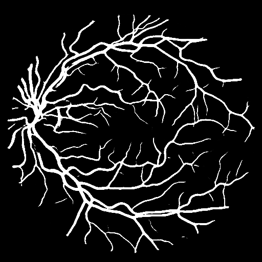

# A PyTorch Implementation of AM_U_Net
[](https://ieeexplore.ieee.org/document/10384478)

Welcome to the PyTorch implementation of [AM_U_Net](https://ieeexplore.ieee.org/document/10384478), a deep-learning model for vessel segmentation in retinal images. This repository provides all the necessary code and instructions to train and test the model on the DRIVE dataset and others.

## Setup Instructions

Follow these steps to get started:


### 1. Clone the Repository
```bash
!git clone https://github.com/Asad-502/UNET.git
```
### 2. Change the Directory to the Repo
```bash
!cd UNET
```
### 3. Upload your Json file kor kaggle environment compatibility
```bash
from google.colab import files
files.upload()
```
### 4. Set Permissions for Json file.
```bash
!mkdir -p ~/.kaggle
!mv kaggle.json ~/.kaggle/
!chmod 600 ~/.kaggle/kaggle.json
```
### 5. Download Kaggle dataset
```bash
!pip install kaggle
!kaggle datasets download -d andrewmvd/drive-digital-retinal-images-for-vessel-extraction
```

### 6. Create a Conda Environment(Skip steps 6 and 7 if you are using Google Colab)
```bash
conda env create -f environment.yml
```

### 7. Activate Conda Environment
```bash
conda activate am_unet
```

### 8. Download Datasets
```bash
bash download_datasets.sh
```

### 9. Train and Test on the DRIVE Dataset
```bash
python main.py --model AM_U_Net --dataset DRIVE --batch_size 16 --learning_rate 0.001 --max_epochs 500 --patience 10 --image_size 512
```

### 10. Inference on Test Image
```bash
python infer.py --model AM_U_Net --checkpoint weights/AM_U_Net_DRIVE_best_model.pth --image_path datasets/DRIVE/test/images/01_test.tif --output_path result.png
```
### 11. Result



